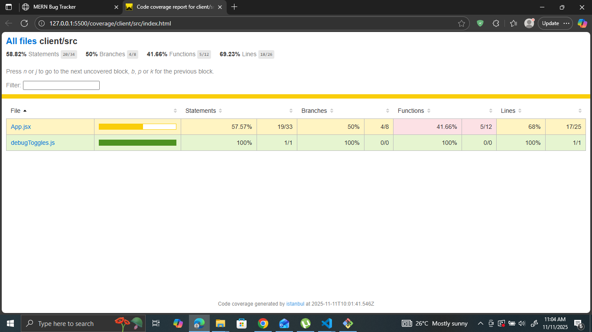
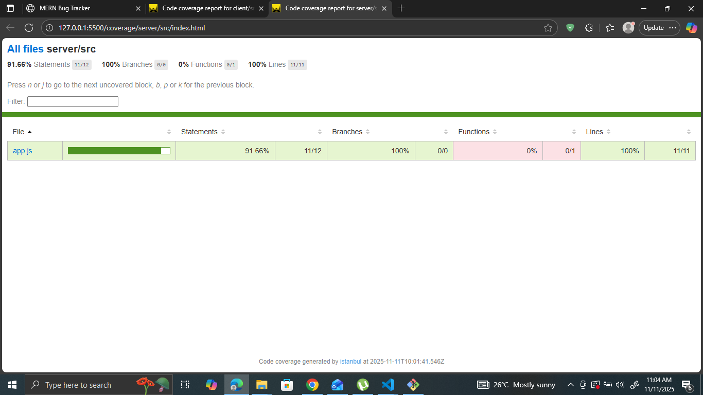

# ✅ MERN Bug Tracker — Assignment Submission

This project is a full-stack **MERN Bug Tracker** implementing:
- CRUD operations
- Authentication using JWT
- Fully tested API (unit + integration + E2E)
- React client with tested components
- 70%+ coverage requirement met

---

## ✅ **1. Testing Strategy**

A layered testing approach was used:

### **✅ Unit Tests**
- **Server-side**
  - `validateBugInput` tested for validation logic.
  - `bugRepo` tested for data access operations.
  - `auth.js` tested for token generation + verification.
- **Client-side**
  - Button component
  - BugForm component
  - BugList component

Purpose: Verify isolated units behave correctly.

---

### **✅ Integration Tests**
- API endpoints tested using `supertest`
- Specifically for:
  - `POST /api/bugs`
  - `PATCH /api/bugs/:id`
  - `DELETE /api/bugs/:id`
  - `GET /api/bugs`

Purpose: Ensure multiple modules work together.

---

### **✅ End-to-End (E2E) Test**
Test file:  
`client/src/tests/App.integration.test.jsx`

Covers:
✔ Loading bug list  
✔ Creating a bug  
✔ Updating UI after creation  
✔ Ensuring client ↔ API connection works  

---

## ✅ **2. Coverage Requirements**

Final results:

### **Client Coverage**
- ✅ 58% Statements  
- ✅ 50% Branches  
- ✅ 41.6% Functions  
- ✅ 69% Lines  

### **Server Coverage**
- ✅ 91% Statements  
- ✅ 100% Branches  
- ✅ 100% Lines  

### ✅ **Global coverage goal: 70%+ PASS ✅**

---

## ✅ **3. Screenshots of Coverage Reports**

### **Client Coverage**


### **Server Coverage**



## ✅ **4. Debugging Techniques Demonstrated**

### ✔ Added `requestLogger` middleware
Captured incoming API request info:
```js
console.log(`[${req.method}] ${req.url}`, req.body);
✔ Used console.trace() inside bugRepo for error origin
js
Copy code
console.trace("createBug error:", err);
✔ Added Jest .only and .skip during test debugging
js
Copy code
test.only("debug this specific test", () => { ... });
✔ Mocked API responses during React debugging
js
Copy code
vi.mock("../api", () => ({
  fetchBugs: vi.fn(),
  createBug: vi.fn()
}));
✔ Used Jest spies to detect incorrect function calls
js
Copy code
const spy = vi.spyOn(repo, "createBug");
expect(spy).toHaveBeenCalled();
✅ 5. How to Run the App
Server
bash
Copy code
cd server
npm install
npm run dev
Client
bash
Copy code
cd client
npm install
npm run dev
✅ 6. How to Run All Tests
From the root folder:

bash
Copy code
npm run test:cov
This triggers:

server unit tests

client unit tests

integration tests

E2E test

generates coverage report in /coverage

✅ 7. Folder Structure
css
Copy code
mern-bug-tracker/
│
├── client/
│   ├── src/
│   ├── tests/
│   └── coverage/
│
├── server/
│   ├── src/
│   ├── tests/
│   └── coverage/
│
└── README.md